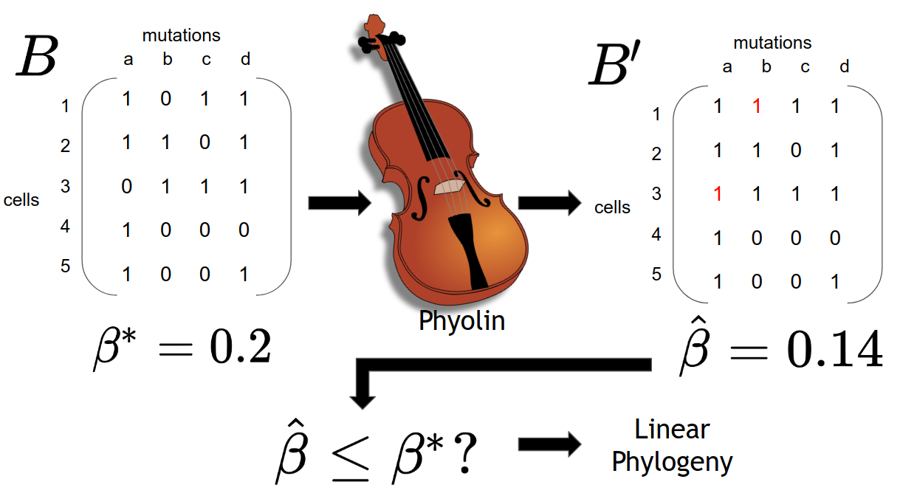

# Phyolin - classifying evolution as linear or branched 

The input to Phyolin is a binary matrix and a threshold false negative rate.  Under the assumption that the phylogeny is linear, Phyolin outputs an estimated false negative rate, an inferred linear phylogeny and classification of the tree topology based on the inputted threshold. 



## Contents

  1. [Getting started](#start)
     * [Dependencies](#dep)
     * [Compilation](#comp)
  2. [Usage instructions](#usage)
     * [I/O formats](#io)
     * [Example](#example)

     

<a name="start"></a>
## Getting started

Phyolin is implemented in C++. 

| Folder    | DESCRIPTION                                                  |
| --------- | ------------------------------------------------------------ |
| `src`     | source code for Phyolin                                      |
| `data`    | example, simulated and real data for Phyolin                             
| `aml_patients`| input and output data for acute myeloid leukemia cohort (Morita et. al (2020)) |re
| `plots`   | output plots 


<a name="dep"></a>

### Dependencies   

Phyolin has the following dependencies:


* [CMake](http://www.cmake.org/) (>= 2.8)
* [Boost](http://www.boost.org) (>= 1.38)
* [lemon] (https://lemon.cs.elte.hu/trac/lemon)
* [CP Optimizer](https://www.ibm.com/analytics/cplex-cp-optimizer) (>= 12.7)

<a name="comp"></a>
### Compilation

To compile Phyolin C++, execute the following commands from the root of the repository:

    $ mkdir build
    $ cd build
    $ cmake .. -DCPLEX=1
    $ make 


The compilation results in the following files in the `build` directory:

EXECUTABLE | DESCRIPTION
-----------|-------------
`phyolin`  | estimate the false negative rate under a null model of a linear topology

<a name="usage"></a>
## Usage Instructions

<a name="io"></a>
### I/O formats
The input to Phyolin is a .csv file that contains n rows and m columns where n is the the number of single-cells and m is the number of mutations.  All entries in the .csv file should be either 1 if mutation j is present in cell i and 0 otherwise. Missing entries should be indicated by -1.  

The output options are:
* a .csv file with the same number of rows and columns after flipping
* a .txt file providing a report of the count of flips made by Phyolin and a prediction based off the input threshold.


```
Usage:
  ./phyolin [--help|-h|-help] [-counts str] [-fn num] [-fp num] [-headers]
     -input str [-output str] [-sep str] [-time int]
Where:
  --help|-h|-help
     Print a short help message
  -counts str
     Filename recording the number of false positive and negative flips
  -fn num
     False Negative Threshold
  -fp num
     Number of False Positives to Allow
  -headers
     Input File has Headers
  -input str
     Binary Single Cell Matrix File
  -output str
     Output filename for output linear phylogeny
  -sep str
     Character separator in input and output files, default is ','
  -time int
     Max runtime in seconds of the solver
```
<a name="example"></a>
## Example
The following is an example of how to use Phyolin.

```
cd data
../build/phyolin -input test_data.csv -ouput test_data_out.csv -counts test_data_predict.out -fn 0.2 -headers

```
